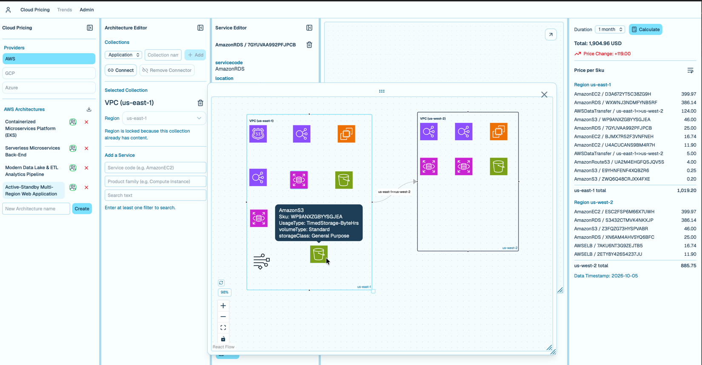

# Cloud Pricing App

A web application for designing cloud architectures and pricing them from real provider price
lists. You lay out an architecture on a canvas — application components, VPCs and the data
connectors between them — pick the exact services and SKUs each part uses from a searchable
catalog, and get a priced total for a chosen duration (on-demand or reserved terms, per region).
Every price comes straight from the provider's published price list; anything that can't be
priced is shown as such, never estimated.

<picture></picture>

What it does today:

- **Architecture canvas**: nested collections (application components inside VPCs), connectors
  for data transfer between them, service icons, drag-and-drop layout.
- **AWS pricing**: catalog search across services and regions, unit-aware pricing over a chosen
  duration, reserved-term upfront and recurring costs, per-region totals.
- **Accounts and sharing**: user accounts, shared architectures, standard architecture templates,
  import and export.
- **Admin tab**: users, and the state of the pricing data (active snapshot and revision, latest
  pipeline run, cache, issues).

Additional Information:

- Pricing data comes from a separate pipeline ([cloud-pricing-data-retrieval](https://github.com/grp3d/cloud-pricing-data-retrieval)), 
which publishes versioned snapshots that the app reads through their manifests from a local folder or S3. 
- Runs on a laptop, or on demand in AWS with one action to bring it up and one to tear it down, keeping all user data across cycles.

## Repository

| Part | What | Docs |
|---|---|---|
| `backend/` | FastAPI API, DuckDB queries over the pricing Parquet, Postgres for user data, ops CLI | [backend/README.md](backend/README.md) |
| `frontend/` | React + Vite + TypeScript web interface | [frontend/README.md](frontend/README.md) |
| `infra/`, `deploy/`, `compose*.yaml` | AWS infrastructure (OpenTofu), the `deploy/app` command, the container stack | [docs/deployment.md](docs/deployment.md) |
| `docs/` | Configuration and the deployment runbook | [docs/configuration.md](docs/configuration.md) |
| `specs/` | Feature specifications, plans and tasks (Spec Kit), one folder per feature | — |

## Roadmap
- [x] Web interface
- [x] AWS pricing integration
- [x] On-demand AWS deployment
- [ ] GCP pricing integration
- [ ] Azure pricing integration
- [ ] LLM integration
